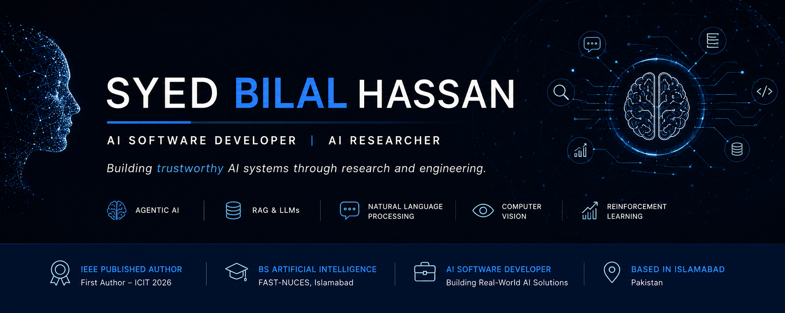

  

<h1 align="center">Syed Bilal Hassan</h1>

AI Software Developer • AI Researcher

Building trustworthy intelligent systems through <strong>Agentic AI</strong>,
<strong>Retrieval-Augmented Generation</strong>,
<strong>Large Language Models</strong>, and
<strong>Computer Vision</strong>.

---

## About Me

I am an AI Software Developer and a graduate in Artificial Intelligence from **FAST – National University of Computer and Emerging Sciences (FAST-NUCES), Islamabad**.

My research focuses on designing intelligent systems that are **reliable, factual, explainable, and deployable**. I am particularly interested in improving the reasoning capabilities of Large Language Models through retrieval-augmented generation, multi-agent architectures, and verification-driven workflows.

I enjoy combining rigorous research with software engineering to build AI systems that move beyond proof-of-concept into practical, production-ready applications.

---

## Research Interests

* Agentic AI
* Retrieval-Augmented Generation (RAG)
* Large Language Models
* Multi-Agent Systems
* Natural Language Processing
* AI Reasoning
* Trustworthy AI
* Computer Vision
* Reinforcement Learning

---

## Research

### Agentic Self-RAG: Multi-Agent Reasoning for Self-Correcting Retrieval-Augmented Generation

**First Author**

Accepted at the **International Conference on IT & Industrial Technologies (ICIT 2026)**

Published in **IEEE Xplore**

#### Highlights

* Proposed a novel multi-agent Self-RAG framework for improving factual grounding in LLMs.
* Designed specialized Query Analyzer, Retrieval Critic, and Answer Verification agents.
* Achieved a **9.1% improvement in Exact Match** on HotpotQA.
* Reduced entity-level hallucinations by **52%** compared to baseline RAG systems.
* Developed an iterative verification-driven reasoning workflow using LangGraph.

---

## Selected Projects

### Agentic Self-RAG

A research framework that combines retrieval augmentation with multi-agent reasoning to improve factual consistency in large language models.

---

### AI-Powered Metro Bus Tracking System

A multi-agent intelligent transportation platform featuring ETA prediction, traffic-aware scheduling, demand forecasting, and route optimization.

---

### End-to-End Autonomous Driving

Conditional Imitation Learning integrated with YOLOv10 for perception-driven autonomous vehicle control using the CARLA simulator.

---

### Multi-Identity Deepfake Detection

A lightweight multimodal framework for detecting manipulated videos involving multiple speakers using visual, audio, and identity-aware representations.

---

### Stable Diffusion Microservice

A scalable text-to-image inference service built using Stable Diffusion XL, Docker, FastAPI, gRPC, and Gradio.

---

### Smart Grid Energy Management

A Deep Reinforcement Learning framework using PPO for multi-objective energy optimization.

---

## Technical Expertise

### Artificial Intelligence

Large Language Models • Agentic AI • Retrieval-Augmented Generation • Computer Vision • Reinforcement Learning • Explainable AI

### Frameworks

PyTorch • TensorFlow • LangChain • LangGraph • Hugging Face Transformers • Scikit-learn

### Backend & Deployment

FastAPI • gRPC • Docker • Kubernetes • Gradio • Streamlit

### Cloud & Infrastructure

AWS • Microsoft Azure • Google Cloud Platform

---

## Current Focus

My current work explores scalable agentic architectures capable of reasoning, retrieving, verifying, and collaborating to solve complex real-world problems. I am particularly interested in trustworthy AI systems that bridge research innovations with production deployment.

---

## Looking Ahead

I plan to pursue graduate research in Artificial Intelligence with a focus on

* Agentic AI
* Retrieval-Augmented Generation
* Large Language Models
* Multi-Agent Systems
* Trustworthy AI

My long-term objective is to contribute to research that advances reliable and deployable intelligent systems for real-world applications.

---

## Connect

📧 **Email:** [syedbilal8803@gmail.com](mailto:syedbilal8803@gmail.com)

💼 **LinkedIn:** https://www.linkedin.com/in/syed-bilal-hassan-kazmi

---

> *"The future of AI depends not only on making models more capable, but on making them more trustworthy."*
